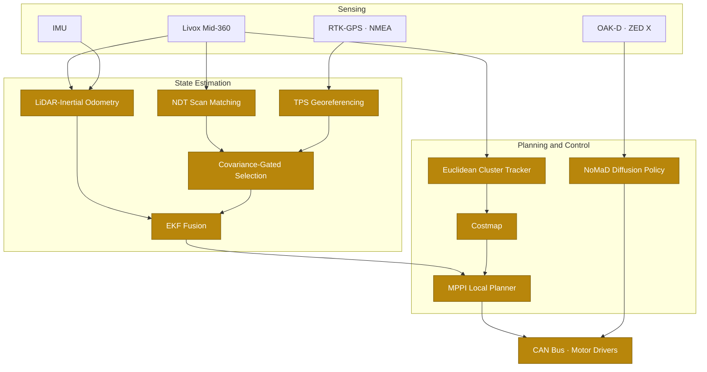

# Gautham Ramkumar

**Robotics Engineer at [Flo Mobility](https://flomobility.com) · Bangalore**

*Localization, state estimation, and learned control for robots that run outside a lab.*

---

I work on the gap between what a robot can perceive and what it should decide to do about it.

Most of my time goes to production autonomy: the navigation and localization stack behind a Material Movement Robot and an autonomous lawnmower, currently running across seven sites in three countries.
The rest goes to the parts of robotics that are still open questions, mostly diffusion policies and foundation models for navigation.

Two peer-reviewed publications. I am 22.

 

## Three problems, and the idea that cracked each one

I find the interesting part of engineering is rarely the implementation.
It is noticing that the standard framing of the problem is wrong.

 

### 1. Drift is a field, not a constant

Every GPS-plus-LiDAR stack I found assumes a single rigid transform between UTM and the map frame.
That assumption quietly fails, because SLAM drift is not uniform: it accumulates differently across space, so one rotation and translation only fits well near wherever you calibrated it.
Travel further, and the alignment error grows with you.

So I stopped modelling drift as a constant and started modelling it as a smooth spatial warp.
During mapping the robot logs GPS-to-map correspondences wherever RTK fix quality is confirmed.
At localization time those correspondences fit a thin plate spline, the interpolant that minimises bending energy over the plane:

$$f(\mathbf{p}) = \mathbf{A}\mathbf{p} + \mathbf{t} + \sum_{i=1}^{n} w_i \, U\big(\lVert \mathbf{p} - \mathbf{c}_i \rVert\big), \qquad U(r) = r^2 \ln r$$

$$E[f] = \sum_{i=1}^{n} \lVert y_i - f(x_i) \rVert^2 + \lambda \iint \left[ f_{xx}^2 + 2 f_{xy}^2 + f_{yy}^2 \right] dx \, dy$$

The rigid transform is just the affine term $\mathbf{A}\mathbf{p} + \mathbf{t}$.
The radial basis sum is the part that was missing.

How the two sources get arbitrated

 

Fitting the warp is only half of it.
The robot still has to decide, continuously, which estimate to believe.

GPS covariance is computed per measurement from live NMEA data using fix quality tier, HDOP, and satellite count, rather than a fixed value pulled from a config file.
Scan-matching covariance is estimated from fitness score, convergence status, correction magnitude, and matched point count.
A fusion node compares the two, with hysteresis so the robot does not oscillate at an indoor-outdoor boundary, and exponential easing so a source change does not produce a visible jump in pose.

The selected pose then feeds a `robot_localization` EKF alongside LiDAR-inertial odometry velocities and IMU angular rates.

The whole architecture is backend-agnostic. It does not care which SLAM or scan-matching system produced the pose.

 

### 2. The expensive model should not be the thing deciding when to run

On the Nissan and Fujitsu road survey prototype, running 4K capture and full detection on every frame pinned the Jetson AGX Orin's GPU at 99 percent.
The obvious move is to shrink the model. That trades away accuracy to fix a scheduling problem.

The actual issue was that the costly stage was gating itself.
So I put a cheap detector in front as a proxy trigger, and gated the 4K pipeline on ROI geometry derived from projected camera field-of-view overlap, so it fires only when a detection lands in the region that matters.

GPU utilization went from 99 percent to under 14 percent, with no loss in capture coverage.

The rest of that system

 

Five independently built subsystems, delivered solo as a prototype:

**Auto-annotation** · A deliberately lightweight YOLOv8 model used as a pseudo-labeler, with candidate annotations validated through Roboflow before entering the dataset. Removed the majority of manual labelling effort.

**Dataset curation** · Merged the public RDD2022 road damage set, frames extracted from Japanese driving footage, and field-collected frames from the survey vehicle itself. Trained a YOLOv8m detector over 6 classes and a YOLOv8s-OBB model over 2 lane classes, oriented boxes being the only honest way to represent lane geometry.

**Azure ML training** · Multi-node MPI cluster jobs for both models. Human-in-the-loop corrections from the field fed straight back into retraining, closing the loop from deployment to model improvement. A post-hoc pole classifier removed false positives without retraining the primary detector.

**DeepStream edge pipeline** · Three e-con CSI cameras, a 4K USB camera, and a parallel ZED X stereo pipeline. GNSS NMEA sentences synchronised per frame, so every saved image, box, and video segment carries an accurate GPS tag. Two parallel streams per camera, one for inference and metadata, one clean stream for raw frames without overlay artifacts. IoU-based detection memory suppressed duplicate saves inside a sliding window. Recording used the hardware H.265 encoder in lossless CQP with session-based file rotation.

**Cloud and visualization** · Size-triggered uploads into partitioned Azure Blob containers, then geotagged detection overlays rendered onto map tiles so engineers could read road condition as a heatmap by location.

100 percent of saved assets GPS-tagged at inference time.

 

### 3. Sometimes a robot does not need a map, it needs a memory of the route

Metric maps are expensive to build, expensive to maintain, and wrong the moment the site changes.
NoMaD sidesteps the question entirely: it navigates by matching what the camera sees now against a topomap, a sequence of images recorded during one prior human-driven traversal, and predicts the next waypoint with a diffusion policy.
No metric map. No GPS. No LiDAR. A monocular camera and odometry.

I took that from paper to a real outdoor lawnmower: found and fixed the gaps in its obstacle avoidance, wired it into the robot's camera, odometry, and PD control layer, and field-tested until the failure modes stopped appearing.
Then I automated the entire loop, so the path from driving a route once to navigating it autonomously is four bash scripts.

The automation

 

`setup.sh` · Generates configs, runs colcon build, pulls NoMaD weights, clones the diffusion policy submodule, and creates both the deploy and train Conda environments.

`run.sh` · Records a trajectory from camera and odometry topics, processes the rosbag into training data, generates the topomap, and launches navigation, in one interactive pass.

`train.sh` · Train from scratch or resume from checkpoint, adjusting model config accordingly, then data split and training in sequence.

`cleanup.sh` · Returns the repo to freshly-cloned state, including rosbags, topomaps, training data, wandb cache, and environments.

Reproducibility is not a nice-to-have on a field robot. If it takes an afternoon to rebuild, it does not get rebuilt.

 

## The stack I own

Highlighted blocks are ones I built, ported, or currently maintain in production.
Writing the OAK-D and CAN bus drivers, HDOP-based GPS quality gating, and the reliability work that keeps all of it running every shift is the same job.

The MPPI controller was the hardest tune.
It samples thousands of candidate trajectories and scores them against the costmap, which is standard, but our platform uses a 4WD T-pivot front axle configuration that maps cleanly onto neither differential nor Ackermann kinematics.
Getting smooth path following out of it on real hardware was most of the work, and it is what made genuinely unmonitored missions possible.

 

## Where it runs

Seven sites, three countries.
Construction sites, factory floors, and national road networks: environments that break the assumptions research code is allowed to make.

| Location | Site | Platform |
|---|---|---|
| Atsugi, Japan | Road network survey, with Nissan and Fujitsu | Jetson AGX Orin survey vehicle |
| Hosur, India | TVS two-wheeler factory campus | Autonomous lawnmower |
| Chennai, India | L&T, joint integration with Mibot | Material Movement Robot |
| Surat, India | L&T | Material Movement Robot |
| Bangalore, India | Prestige Group | Material Movement Robot |
| UAE | TTE, Al-Gurg Group | Material Movement Robot |
| UAE | SRP Constructions, Roma Residency | Material Movement Robot |

Production robotics is a different discipline from research.
The stack has to work every shift, across sites, on hardware that varies, in weather nobody asked for.
Owning that means owning reliability, not features.

 

## Published research

**Rocker-Bogie Mechanisms for Stair-Climbing Robots: A Comprehensive Review of Design Optimization and Control**
IEEE ICCRTEE, July 2025 · [10.1109/ICCRTEE64519.2025.11053041](https://doi.org/10.1109/ICCRTEE64519.2025.11053041)

**Acoustic Fire Extinguishing Technologies: A Comprehensive Review of Advancements, Challenges, and Future Prospects**
AIP Publishing, February 2026 · [10.1063/5.0316279](https://doi.org/10.1063/5.0316279)

The hardware behind the first paper

 

A rocker-bogie stair-climbing robot with a dynamic center pivot, built end to end alongside a full-time job: mechanical design, electronics, firmware, simulation, and software.

Forward kinematics modelled in MATLAB, torque requirements validated in Simscape, and link lengths chosen by Taguchi optimization under the design constraints rather than by iteration.
Chassis designed in Fusion 360 in sheet metal with 3D-printed linkages, DDSM400 hub motors driven over LIN from an ESP32.

It climbs 15 cm stairs carrying a 2.5 kg payload.

And the second

 

Acoustic fire suppression uses low-frequency pressure waves, roughly 30 to 70 Hz, to break the fire triangle with no water and no chemical residue: displacing oxygen locally, destabilising the flame front, dispersing fuel vapour, and disrupting the thermal boundary.

The finding I care about from the build is the coupling between driver power and the frequency that actually works.
A 60 W subwoofer extinguishes at around 60 Hz.
Lower-wattage drivers need higher frequencies, and at that point they stop being practical without an acoustic lens or a vortex tube to focus the wavefront.

Useful where water is the worse outcome: server rooms, ship compartments, drone-mounted suppression.

 

## Repositories

[**Navigation-via-Masked-Diffusion-ROS2**](https://github.com/Gautham-Ramkumar03/Navigation-via-Masked-Diffusion-ROS2)
NoMaD ported to ROS2 Humble. Goal-conditioned topological navigation from a monocular camera, with the full record-to-navigate pipeline automated.

[**deepstream-yolo-data-collection-toolkit**](https://github.com/Gautham-Ramkumar03/deepstream-yolo-data-collection-toolkit)
Multi-camera DeepStream and YOLO pipeline for automated dataset collection from live feeds, with per-frame GPS tagging and proxy-triggered high-resolution capture.

[**auto_annotation_pipeline**](https://github.com/Gautham-Ramkumar03/auto_annotation_pipeline)
Bootstraps a labelled dataset from unlabelled footage using a lightweight model as pseudo-labeler.

[**azure-ml-yolo-trainer**](https://github.com/Gautham-Ramkumar03/azure-ml-yolo-trainer)
Declare cluster, dataset, and model in one YAML. Train YOLO on Azure ML with one command instead of wiring the portal by hand.

[**azure-custom-vision-coco-uploader**](https://github.com/Gautham-Ramkumar03/azure-custom-vision-coco-uploader)
Pushes a COCO dataset straight into Azure Custom Vision: creates the project, converts boxes, uploads in batches. Written after annotating too many images through a web portal.

[**DDSM400-ps4-control**](https://github.com/Gautham-Ramkumar03/DDSM400-ps4-control)
DDSM400 hub motor control over LIN, from the stair-climbing robot build.

 

## Toolchain

**Languages** · Python, C++, Bash
**Robotics** · ROS2 Humble, Gazebo, `robot_localization`, Nav2, MPPI, NDT, LIO
**Learning** · PyTorch, diffusion policies, YOLOv8, TensorRT, ONNX
**Edge** · Jetson AGX Orin, DeepStream, Livox Mid-360, OAK-D, ZED X, CAN, LIN
**Cloud** · Azure ML, Azure Blob, AWS, Docker
**Design** · Fusion 360, MATLAB, Simscape

 

---

### Let's talk robots

Open to research collaborations in embodied AI, SLAM, and learned control.

